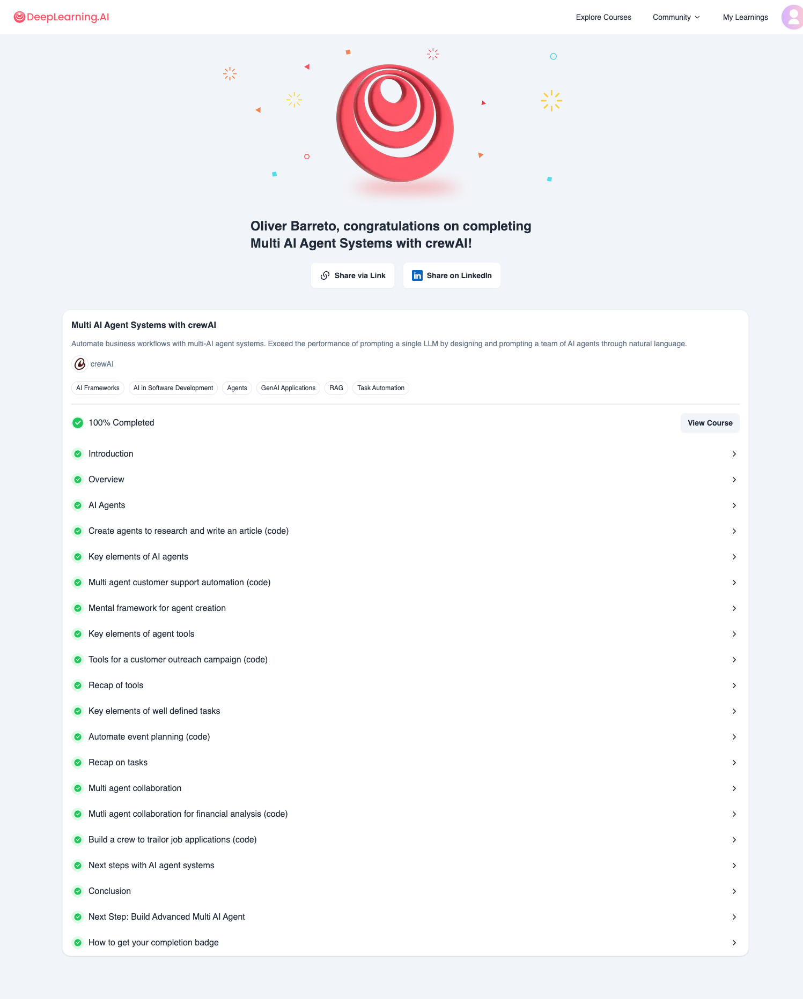

# deeplearning.ai.crewai.multiagentsystems
Deeplearning.ai - Course - Multi AI Agent Systems with crewAI

- Course Online: https://learn.deeplearning.ai/courses/multi-ai-agent-systems-with-crewai/
- Git repo: https://github.com/deeplearning-ai/crewai-course-multi-ai-agent-systems
- Jupiter Notebooks of the course
- Finished: 10 diciembre 2024

# Lessons:
1. Introduction
2. Overview
3. AI Agents
4. Create agents to research and write an article (code)
5. Key elements of AI agents
6. Multi agent customer support automation (code)
7. Mental framework for agent creation
8. Key elements of agent tools
9. Tools for a customer outreach campaign (code)
10. Recap of tools
11. Key elements of well defined tasks
12. Automate event planning (code)
13. Recap on tasks
14. Multi agent collaboration
15. Mutli agent collaboration for financial analysis (code)
16. Build a crew to trailor job applications (code)
17. Next steps with AI agent systems
18. Conclusion
19. Next Step: Build Advanced Multi AI Agent
20. How to get your completion badge

